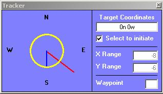

<div align="center">

## Active Worlds User Compass


</div>

### Description

This is a piece of code rather specialist in that it is developed for use with the Active Worlds Browser (www.activeworlds.com) it is a sister application that will allow you to enter a set of Active Worlds Coordinates into the targeting box and be shown the direction to which you must face to arrive at those coordinates. Thanks to the VB super API spy (on PSC) for helping me learn about the API to make this possible.
 
### More Info
 
Takes title bar text from AW Browser

This requires the Active Worlds Browser active in order for it to correctly function.

A visual compass of the direction you wish to walk in to reach the coordinates you enter.

You may bumb into walls and such while using.


<span>             |<span>
---                |---
**Submitted On**   |2002-04-22 18:41:38
**By**             |[Mark Randall](https://github.com/Planet-Source-Code/PSCIndex/blob/master/ByAuthor/mark-randall.md)
**Level**          |Intermediate
**User Rating**    |5.0 (10 globes from 2 users)
**Compatibility**  |VB 6\.0
**Category**       |[Miscellaneous](https://github.com/Planet-Source-Code/PSCIndex/blob/master/ByCategory/miscellaneous__1-1.md)
**World**          |[Visual Basic](https://github.com/Planet-Source-Code/PSCIndex/blob/master/ByWorld/visual-basic.md)
**Archive File**   |[Active\_Wor1576534192003\.zip](https://github.com/Planet-Source-Code/mark-randall-active-worlds-user-compass__1-44881/archive/master.zip)

### API Declarations

```
API to retrieve window caption.
mdlFindWindows:
Public Declare Function GetDesktopWindow Lib "user32" () As Long
Public Declare Function GetWindow Lib "user32" ByVal hWnd As Long, ByVal wCmd As Long) As Long
Public Declare Function GetWindowText Lib "user32" Alias "GetWindowTextA" (ByVal hWnd As Long, ByVal lpString As String, ByVal cch As Long) As Long
Public Declare Function GetClassName Lib "user32" Alias "GetClassNameA"
 (ByVal hWnd As Long, ByVal lpClassName As String, ByVal nMaxCount As Long) As Long
clsOnTop:
Private Declare Function SetWindowPos Lib "user32" (ByVal hWnd As Long, ByVal hWndInsertAfter As Long, ByVal x As Long, y, ByVal cx As Long, ByVal cy As Long, ByVal wFlags As Long) As Long
```


